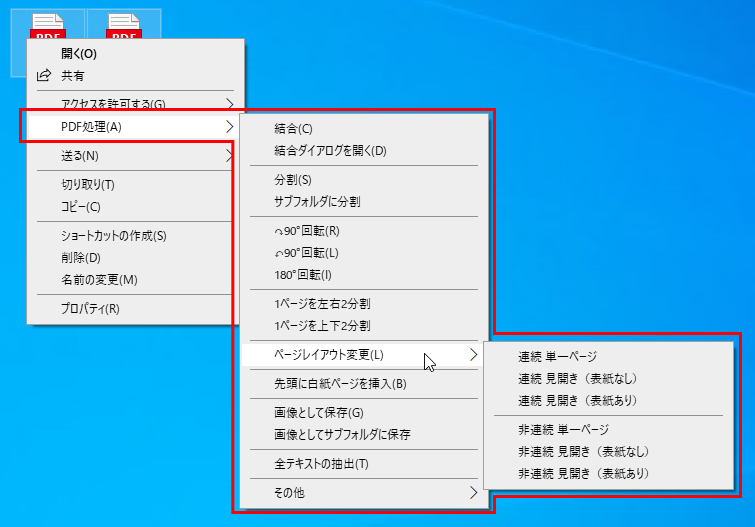

# pdf_rclick
 
## 概要

PDFファイルの右クリックメニューからPDFファイルを編集できるようにします。  
* 結合
* 結合ダイアログを開く
* 分割
* 回転
* ページ内2分割（左右分割、上下分割）
* ページレイアウト変更
* 先頭に白紙ページを挿入
* 画像として保存
* 全テキスト抽出

  

## 注意事項

* 元ファイルとは別のファイルを作成して上書き保存します。同名の既存ファイルがある場合は上書きされますので注意してください。
* PDFファイルのセキュリティ設定によっては編集できない場合があります。
* インストール後の初回クリック時は、メニューが出てくるまでに時間がかかります。

## 各種設定

`pdf_rclick.ini`を編集することで右クリックしたときに表示されるメニュー名を変更できます。  

```
[setting]
name=PDF処理(&A)
```
`name` : 右クリックしたときに表示されるメニュー名です。  

## インストール、アンインストール方法

**バッチファイルを利用する場合**  

* `pdf_rclick.dll`と同じフォルダに`install_uninstall.bat`をコピーします。  
* `install_uninstall.bat`を右クリックして「管理者として実行」を選択します。  
*  表示に従ってインストール/アンインストールします。  

**バッチファイルを利用しない場合**  

  インストール  
   ```bat
   RegAsm.exe /codebase pdf_rclick.dll
   ```

  アンインストール  
   ```bat
   RegAsm.exe /u pdf_rclick.dll
   ```

## 動作確認環境
Microsoft Windows10 x64 + .NET Framework 4.8

## ライセンス

This software is released under the MIT License.   
詳細については、[LICENSE](./LICENSE) ファイルを参照してください。  

This software includes the following works:  
[ThirdPartyLICENSEフォルダ](./ThirdPartyLICENSE/)内の全てのファイルを確認してください。  

|Work|Documents|Remarks|
|:----|:----|:----|
|SharpShell 2.7.2|[LICENSE.md](./ThirdPartyLICENSE/SharpShell/LICENSE.md)|[NuGet](https://www.nuget.org/packages/SharpShell)|
|PdfSharp 1.50.5147|[LICENSE](./ThirdPartyLICENSE/PDFsharp/LICENSE)|[NuGet](https://www.nuget.org/packages/PdfSharp/1.50.5147)|
|PdfiumViewer 2.13.0|[LICENSE](./ThirdPartyLICENSE/PdfiumViewer/LICENSE)<br>[LICENSE PDFium](./ThirdPartyLICENSE/PdfiumViewer/LICENSE%20PDFium)|[NuGet](https://www.nuget.org/packages/PdfiumViewer/2.13.0)|
|PdfiumViewer.Native.x86_64.v8 - xfa 2018.4.8.256|[LICENSE](./ThirdPartyLICENSE/PdfiumViewer.Native.x86_64.v8-xfa/LICENSE)|[NuGet](https://www.nuget.org/packages/PdfiumViewer.Native.x86_64.v8-xfa/2018.4.8.256)|

